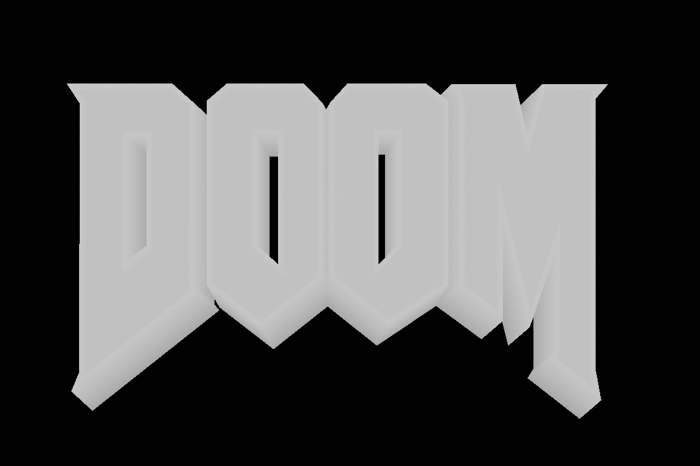

# HID3N

A utility for generating [autostereograms](https://en.wikipedia.org/wiki/Autostereogram) (i.e. those funny pictures in the ["Magic Eye"](https://en.wikipedia.org/wiki/Magic_Eye) books).




Based on the paper ["Displaying 3D Images: Algorithms for Single Image Random Dot Stereograms"](https://harold.thimbleby.net/sirds/ieee3d.pdf) by Thimbleby, H. & Inglis, S. & Witten, I. (1994).

### Requirements

- Linux
- GCC 14+

### Build & Run

```bash
make
```
