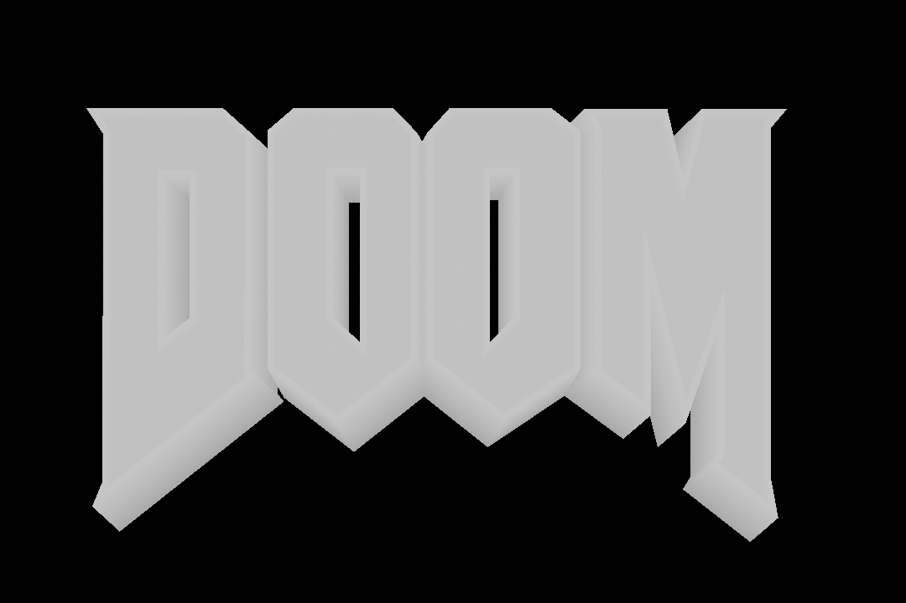
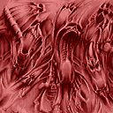

# HID3N

A utility for generating [autostereograms](https://en.wikipedia.org/wiki/Autostereogram) (i.e. those funny pictures in the ["Magic Eye"](https://en.wikipedia.org/wiki/Magic_Eye) books).

Based on the paper ["Displaying 3D Images: Algorithms for Single Image Random Dot Stereograms"](https://harold.thimbleby.net/sirds/ieee3d.pdf) by Thimbleby, H. & Inglis, S. & Witten, I. (1994).

### Requirements

- Linux
- GCC 14+

### Build

```bash
make
```

### Usage

```text
Usage: hid3n <zmap.bmp> <pattern.bmp> <output.bmp>
```

### Example

Depth map:  


Pattern image:  


Resulting autostereogram:  


See more [examples here](/examples/EXAMPLES.md).
